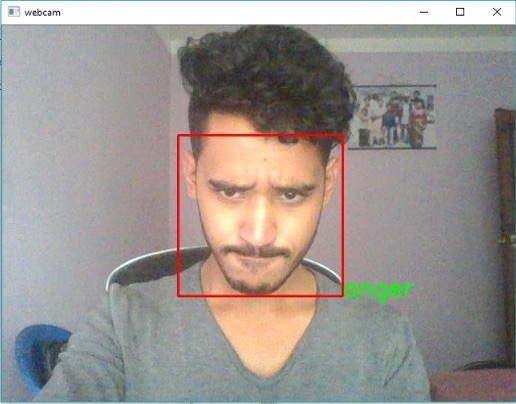

# Facial Expression Recognition System

This project implements a **Facial Expression Recognition** (FER) system using **OpenCV’s FisherFaceRecognizer**. It loads a dataset of facial expressions, trains a classifier, and evaluates its performance. The project is structured for modularity, reproducibility, and easy extension to advanced ML methods.

---

## Table of Contents

- [Features](#features)  
- [Dataset](#dataset)  
- [Installation](#installation)  
- [Usage](#usage)  
- [Project Structure](#project-structure)  
- [Training](#training)  
- [Evaluation](#evaluation)  
- [Results](#results)
- [Outpur Sample](#output-sample)  
- [Future Improvements](#future-improvements)  

---

## Features

- Train a **FisherFaceRecognizer** for emotion classification.  
- Modular code: separate training and evaluation scripts.  
- Grayscale preprocessing for faster computation.  
- Automatically splits dataset into **67% training** and **33% validation**.  
- Saves trained model to disk (`result/fisher_model.xml`) for reuse.  

---

## Dataset

- The project uses a dataset organized as:
```bash
facial-dataset/          # Training dataset
│   └── train/
│       ├── Anger/
│       ├── Contempt/
│       ├── Disgust/
|       ├── Fear/
│       ├── Happy/
│       ├── Neutral/
|       ├── Sadness/
│       └── Surprise/
```
- Each subfolder contains images corresponding to a particular emotion.  
- The dataset can be replaced or expanded with **FER2013**, **CK+**, or custom datasets.

---

## Installation

1. **Clone the repository:**

```bash
git clone https://github.com/ranjan0369/Facial-Expression-Recognition-System.git
cd Facial-Expression-Recognition-System
```

2. **Install dependencies using Pipenv:**
```bash
pip install pipenv
pipenv install --dev
```

3. **Activate the Pipenv shell:**
```bash
pipenv shell
```
---

## Usage
**Train the model:**
```bash
python src/train_model.py
```

- Trains FisherFaceRecognizer on the dataset.

- Saves the trained model to result/fisher_model.xml.

**Evaluate the model:**
```bash
python src/evaluate_model.py
```

- Loads the saved model and evaluates accuracy on the validation set.

- Prints validation accuracy to the console.

**Test the model:**
```bash
python main.py

---

## Project Structure
```bash
project/
├── src/
│   ├── train_model.py       # Script to train and save the model
│   └── evaluate_model.py    # Script to evaluate the model
├── facial-dataset/          # Training dataset
│   └── train/
│       ├── happy/
│       ├── sad/
│       └── ...
├── result/
│   └── fisher_model.xml     # Saved model
├── Pipfile
├── Pipfile.lock
└── README.md
```
---

## Training

- Uses cv2.face.FisherFaceRecognizer_create().

- Preprocesses all images as grayscale arrays.

- Automatically shuffles and splits dataset into training and validation sets.

---

## Evaluation

- Loads the trained model (fisher_model.xml).

- Runs predictions on the validation set.

- Computes accuracy:

```bash
Accuracy (%) = (Correct Predictions / Total Validation Images) * 100
```
---

## Results

Example output after running evaluate_model.py:

```bash
Validation Accuracy: 78.5%
```
Accuracy may vary depending on dataset quality and size.

---

## Output Sample




---

## Future Improvements

- Replace FisherFace with CNN-based models (MobileNet, ResNet) for higher accuracy.

- Implement face alignment using MTCNN/dlib landmarks.

- Add data augmentation (rotations, flips, brightness variations).

- Create a web demo using Streamlit or Flask.

- Include explainability visualizations (Grad-CAM) for model predictions.

- Dockerize the full pipeline for reproducibility.
---

## License

MIT License – free to use and modify for personal, academic, or professional purposes.

---

## Contact

For questions or collaborations, reach out to Ranjan Shrestha: [ranjan.shrestha0369@gmail.com]